# Summary
This is an ExositeReady™ Embedded SDK Client VFP (Vendor Framework Port) for the Microchip WCM board.
In addition, there is a demo application that is the default build for this VFP.  This readme guide will explain how to build and run the demo.  

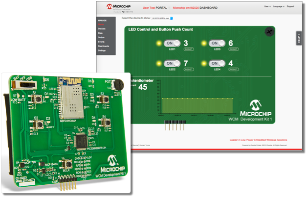

Already built or want to use a pre-built binary? [Jump to Running the Demo Application](#running-the-demo) section.

# VFP Installation and Build Guide
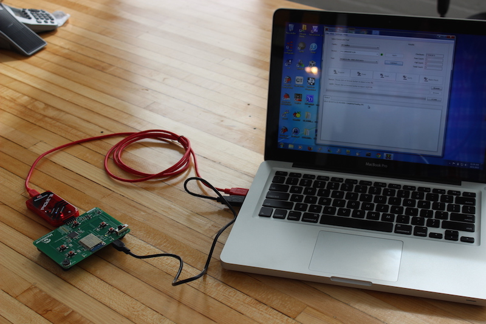

## What you need to build

* Access to this source repository to clone (git term) or download to your computer.
* [GIT](https://en.wikipedia.org/wiki/Git_(software) (recommended otherwise manual download and installation is feasible but not covered)
* A Command Line terminal for your computer
* The Microchip WCM SDK (link to download below)
* [Microchip's MPLAB IDE](http://www.microchip.com/pagehandler/en-us/family/mplabx/) (v2.35 or greater) installed on your computer.  
* Make sure that the Microchip xc32 Compiler is version 1.34.
   _If not - you can download the installer from the Archive tab on this site:_
   http://www.microchip.com/pagehandler/en-us/devtools/mplabxc/home.html#can-the-mplab-xc-compilers
   

## Install and Build
To build the VFP and demo application, the VFP needs the Microchip's WCM SDK.  This WCM SDK needs be installed to a given path in the VFP/SDK directory so that the project file in the application can find it.  
The MPLABX and XC32 compiler also have to be installed separately, the MPLAB installer won't install XC32 and XC32 version 1.34 is needed to build this application.  

_Note that any commands shown below starting with `>` represent running the command on a command line terminal.  These commands will work as is on Linux or Mac machine, assuming git is installed.  Windows will require [Cygwin](http://cygwin.com/) or other tools to run .sh file._

1. Clone the repository locally

   ```> git clone https://github.com/exosite-ready/er_vfp_microchip_wcm.git```

   _Note: You may also download the zip file for this repository and unzip it.  This will require more manual steps to pull in the other SDK components.  GIT allows you to use the submodule update command and is the recommended approach._

2. Go into the `er_vfp_microchip_wcm` directory

   ```> cd er_vfp_microchip_wcm```

3. Install the submodules required for the SDK build.

   ```> git submodule update --init --recursive```

4. Download Microchip's WCM SDK from [WCM Firmware  01.00.00](http://www.microchip.com/mymicrochip/filehandler.aspx?ddocname=en571775).  

   _Note that this is the SDK provided and supported by Microchip which can not be redistributed, which is why this has a separate installation path_.  

5. Install the SDK by unzipping `WCM_DK1_01.00.00.zip` into a folder named `3rd_party` relative to the `../er_vfp_microchip_wcm folder`

   Example:
     - If the client is cloned to: /opt/er_vfp_microchip_wcm
     - Then the WCM DK should be in /opt/3rd_party/WCM_DK1_01.00.00

     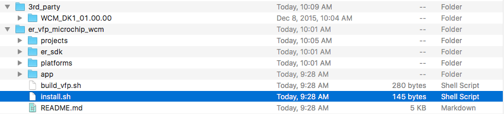

6. Patch the VFP with files from the SDK by running ./install.sh from the er_vfp_microchip_wcm folder

   ```> ./install.sh```

   _Should look something like this if using Linux or Mac machine.  Windows will require Cygwin or other tool to run .sh file._
    ```
    $ ./install.sh
    patching file WCM_DK1_01.00.00/apps/tcpip/wcm_dev_kit_1/firmware/src/app.h
    patching file WCM_DK1_01.00.00/apps/tcpip/wcm_dev_kit_1/firmware/src/custom_http_app.c
    patching file WCM_DK1_01.00.00/framework/driver/wifi/mrf24w/drv_wifi.h
    patching file WCM_DK1_01.00.00/framework/driver/wifi/mrf24w/src/drv_wifi_com.c
    patching file WCM_DK1_01.00.00/framework/driver/wifi/mrf24w/src/drv_wifi_event_handler.c
    patching file WCM_DK1_01.00.00/framework/driver/wifi/mrf24w/src/drv_wifi_init.c
    patching file WCM_DK1_01.00.00/framework/tcpip/src/http.c
    ```
7. Open the project `EmbeddedClient-Microchip-WCM` from MPLAB

   

8. Build the demo project with MPLAB.  This may take a few of minutes.

   

   

9. You now have a binary file to deploy/flash on your development kit.  Find detailed instruction on how to Download and use a binary below.


# Running the Demo
## What you need to flash the kit and run the demo

* A pre-built binary file for the demo application. (See steps above to build yourself or pre-built binaries in the repository)
  * Prebuilt Binaries: https://github.com/exosite-ready/er_vfp_microchip_wcm/releases
* [Microchip WCM Development Kit 1](http://www.microchipdirect.com/ProductSearch.aspx?keywords=dm182020)
* USB cable
* An account on [microchip.exosite.com](https://microchip.exosite.com)
* [PICkit 3](http://www.microchip.com/Developmenttools/ProductDetails.aspx?PartNO=PG164130)

  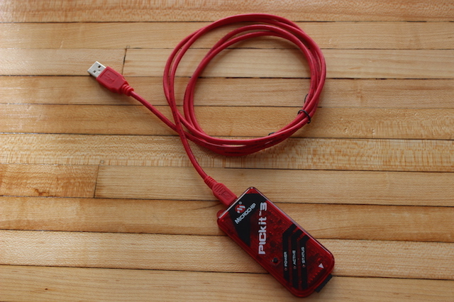

* [Microchip's MPLAB IDE or IDE](http://www.microchip.com/pagehandler/en-us/family/mplabx/) (v2.35 or greater) installed on your computer.  

## Hardware Setup
1. Connect a PICkit3 to the WCM's "ICSP" connector.
   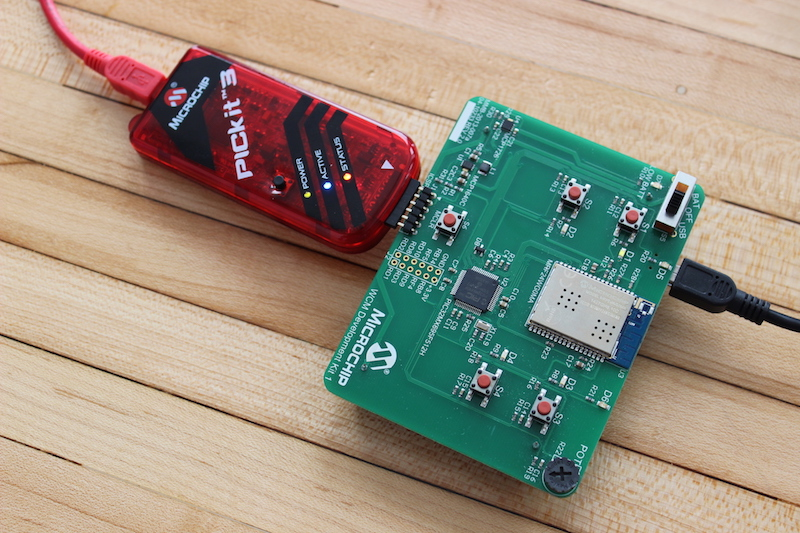
2. Connect a USB cable to the WCM's "J3" connector.
3. (Optional) Connect a USB to TTL UART converter to "J2". J2.GND-GND. J2.RF5-RXD.
4. Turn on power switch ("S5").

## Flashing the Firmware
### Using MPLAB IPE
If using a pre-built binary, you can choose to use the MPLAB IDE or a simpler tool called MPLAB IPE.

1. Download the pre-built binary zip file (e.g. EmbeddedClient-Microchip-WCM_prebuilt_binary_x-x-x.zip), unzip it,  and identify the the binary .hex file for use of programming the hardware.  Pre-built binaries are found in [Releases](https://github.com/exosite-ready/er_vfp_microchip_wcm/releases)

2. Open "MPLAB IPE" v2.35 or greater - This is a programming tool from Microchip installed with the MPLAB IDE Install.

3. Select "Device" -> PIC32MX695F512H

4. Select "Tool" -> PICkit3

4. Press "Connect" button.
   

5. You should see the message "Connecting to MPLAB PICkit 3..."

6. Press "Browse" button, and choose the downloaded .hex file "ec_microchip_wcm-x.y.z.hex",
   where x.y.z is the version number.

7. Press "Program" button.

   

8. After programming, WCM D1 will be on;  if the board could connect with wifi to an AP D5 will be on, D1 will be off
   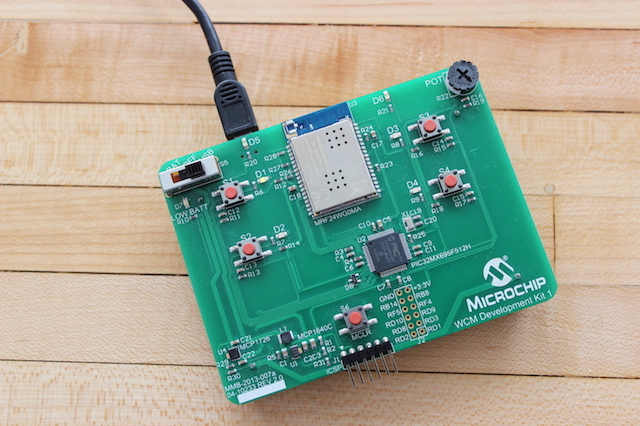

### Using MPLAB IDE
If using a pre-built binary, you can choose to use the MPLAB IDE or a simpler tool called MPLAB IPE.

1. Open the project `EmbeddedClient-Microchip-WCM` from MPLAB IDE

   

2. Make sure the power Switch S5 on WCM board is turned to USB to power board.

3. Verify PICkit3 is connected to WCM board and to your computer via USB. (Note: Default is PICkit3 does not power board)

4. Press 'Make and Program Device' Button

   

5. After programming, WCM D1 will be on; if the board could connect with wifi to an AP D5 will be on, D1 will be off.


# Running the Demo Application
The Demo application is just that, an example to demonstrate this development kit as a connected / IoT device to the Exosite platform.  The demo does the following:

* If no prior WiFi configuration or WiFi not accessible, will run as Access Point mode to allow a user to configure the WiFi setup and access the device's unique provisioning number necessary to 'claim ownership' in the Web Portal application.

* With an good WiFi / Internet Connection - the client will activate the device to the Exosite Platform if not already activated.  This assumes a user has added the device to their [https://microchip.exosite.com](https://microchip.exosite.com) portal.

      _If the device config memory does not contain a valid configuration
      (i.e after a firmware update) then make sure that the device
      is not yet activated, otherwise the activation will fail and
      the device won't work_

* It Checks the state of 4 buttons on the WCM Board (S1..S4) and
  sends values to the Exosite platform if a button is pressed.
  The notification value is 1 for the 1st button press, 0 for the
  next button press, then 0 and so on.

* In Parallel, it subscribes to the "led" data resource in the platform and toggles
  four LEDs (D1 .. D4) based on the last value set on the platform side.
  The value of "led" contains the (desired) binary encoded states of the
  four LEDs, e.g.:
    ```
    value = 1 turns on 1st led
    value = 2 turns on 2nd led
    value = 3 turns on 1st and 2nd led
    value = 4 turns on 3rd led
    value = 5 turns off 1st and 3rd led
    value = 6 turns off 2nd and 3rd led
    value = 7 turns off 1st, 2nd and 3rd led
    value = 8 turns off 4th led
    ```

* It sends the value of the potentiometer every 5 seconds


## Setting up the WiFi Network Connection
1. Make sure your WCM Kit is powered using USB or Batteries.  (_Note that the demo application has no low power states built in and will not run long_) and is switched to a power on state.
2. Connect to the SSID "xxxxxx_WCM" WiFI Access Point with your computer.  

   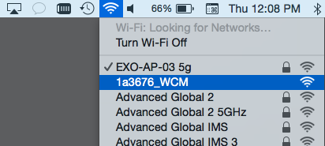

3. Open your web browser, and navigate to http://192.168.1.25, which will display a WiFi Configuration utility.

   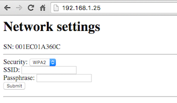

4. Input your AP router information and click the Submit button.

   _The WCM's AP WiFi connection should drop from your computer and LED D5/D6 on the WCM board should be on.
   The device should be attempting to connect to the local WiFi network.  Then it will keep attempting to activate with Exosite until it activates and receives a CIK._

   **Important:** Copy the Serial Number presented in this window - it is required to add your device to your https://microchip.exosite.com account.  

   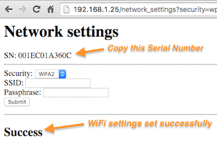


## Cloud Setup
1. Go to [http://microchip.exosite.com](http://microchip.exosite.com) and sign up for a (free) account if you do not already have one.  There is an email verification process for new sign-ups.

   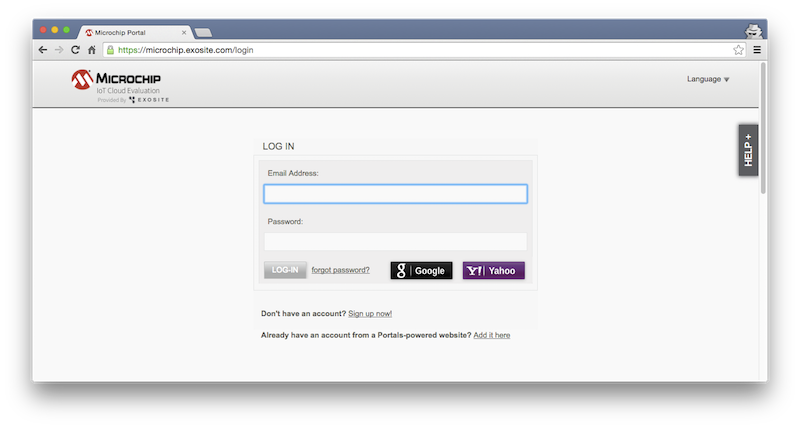

2. Add a "WCM Development Kit 1" device with its MAC address which is the Serial Number value you copied above from the WiFi network settings utility.

   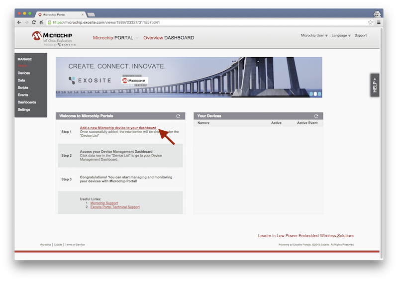

   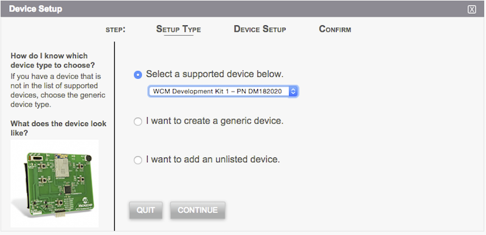

   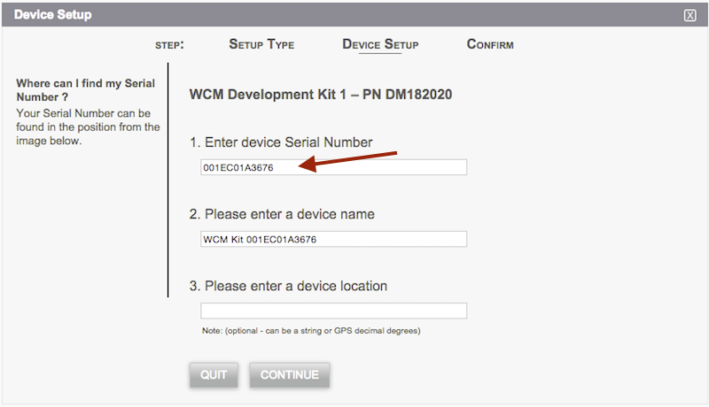

   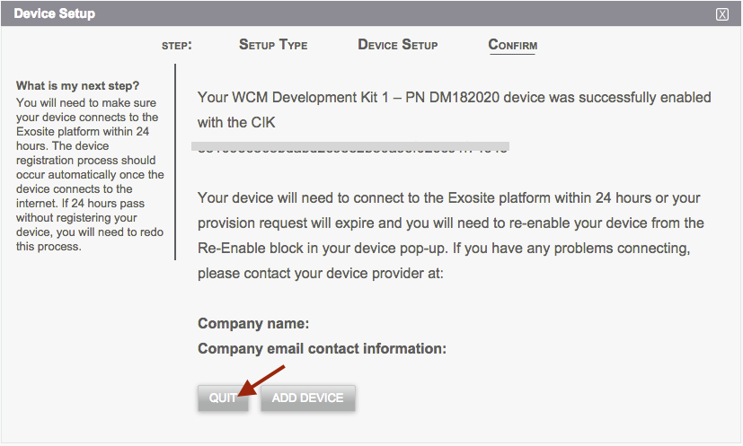

   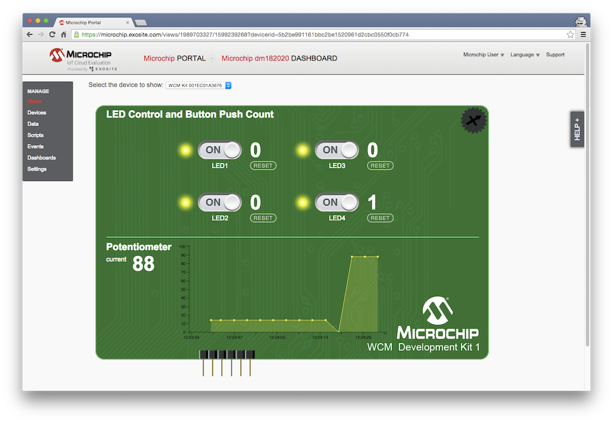

3. **Success.**  You can now use the Portal application to interact with the board, add custom dashboards, server side Lua scripts, more data ports, and events/alerts.  The device application code can also be customized to add new features that meet your device needs.

   * [Exosite Documentation](http://docs.exosite.com/)


## Notes
### Troubleshooting:
If the board fails to activate, you may need to re-enable the client in Portals or press the reset button on the board. See the following debug terminal output conditions:

   * _The following message shows up in the terminal: "Error [-106]: Activate request returned error"_

     This means the device needs to be re-enabled in the Exosite Platform.  You can use the Portals web application for this.  

   * _If you see "Error [-107]: Activate request returned error"_

     This means your device was not yet added to the platform and claimed by a owner; please follow the instructions in Cloud setup: step 1 and 2

### Debug Terminal (Optional):
1. Open serial terminal application with baudrate of 115200.
2. Press WCM S6. Observe MAC information if needed.

### Resetting AP setting
1. Turn off the board
2. Press S1 and keep pressing while turning on the board
3. Turn on the board
4. Keep pressing S1 until D1 is turned on
5. Now you can reconfigure the AP settings with the method in chapter #Network Setup

### Re-progamming the board
When you program the board, it removes the Exosite Platform CIK, which is a private device key.  If the device was already activated, it will need to be re-enabled through the Portals web application.

# Support
If you are running into problems, please feel free to check out our [developer community forum](https://community.exosite.com/c/hardware-platforms/microchip-kits) or use our [support site](https://support.exosite.com).
